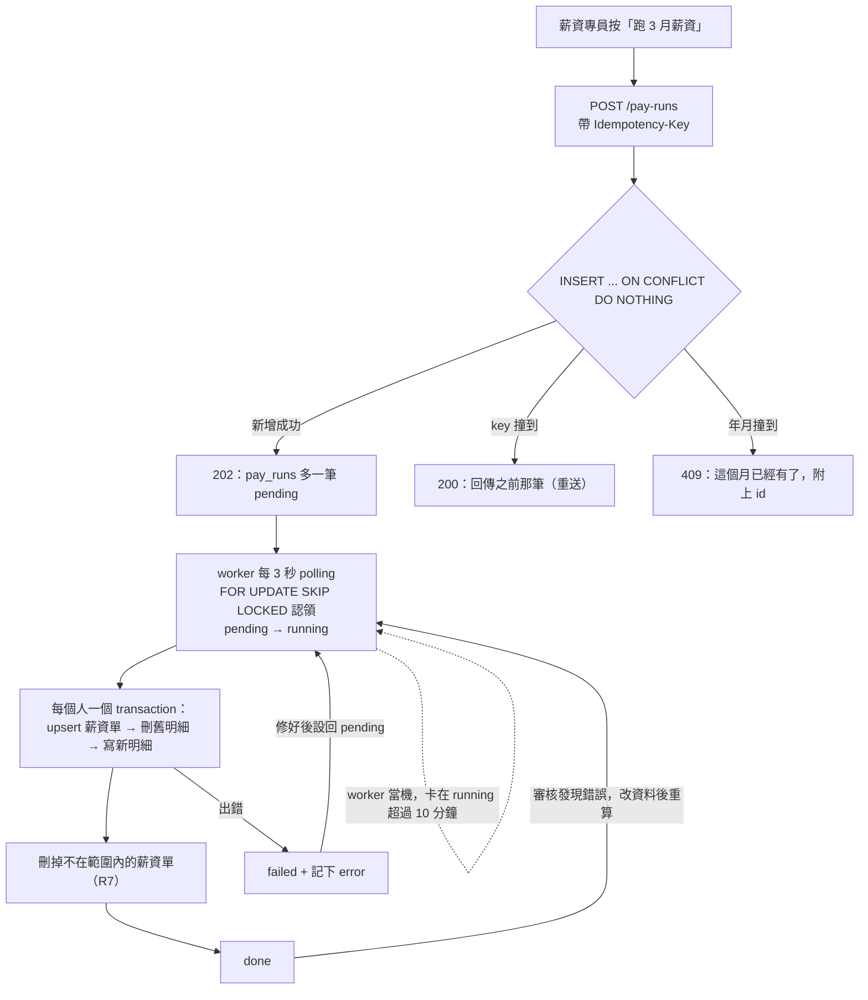

# Mini Contract Payroll

## Pay run flow

```mermaid
flowchart TD
    A[薪資專員按「跑 3 月薪資」] --> B["POST /pay-runs<br/>帶 Idempotency-Key"]
    B --> C{INSERT ... ON CONFLICT DO NOTHING}
    C -->|新增成功| D["202：pay_runs 多一筆 pending"]
    C -->|key 撞到| E["200：回傳之前那筆（重送）"]
    C -->|年月撞到| F["409：這個月已經有了，附上 id"]

    D --> G["worker 每 3 秒 polling<br/>FOR UPDATE SKIP LOCKED 認領<br/>pending → running"]
    G --> H["每個人一個 transaction：<br/>upsert 薪資單 → 刪舊明細 → 寫新明細"]
    H --> I["刪掉不在範圍內的薪資單（R7）"]
    I --> J[done]
    H -->|出錯| K["failed + 記下 error"]
    K -->|修好後設回 pending| G
    J -->|審核發現錯誤，改資料後重算| G
    G -.->|worker 當機，卡在 running 超過 10 分鐘| G
```
